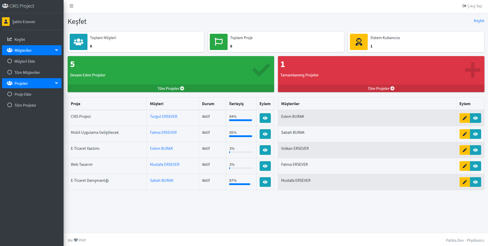

### CMS Projesi - (Patika-PhpBasics)
PHPBasics Müşteri Yönetim Sistemi Projesi

##### Neler Yaptık?

- [x] Composer PSR4 Autoload Sistemi
- [x] OOP MVC Çatısı 
- [x] Klasör Yapısı
- [x] Routing Sınıf Entegrasyonu(bramus/router)
- [x] Yardımcı Sınıfların Hazırlanması
- [x] Controller Hazırlanması
- [x] Model Hazırlanması
- [x] View Hazırlanması
- [x] Yardımcı Fonksiyonların Dahil Edilmesi
- [x] Veritabanı Hazırlanması

##### Program Özellikleri

- [x] Oturum Yönetimi
- [x] Müşteri İşlemleri
- [x] Proje İşlemleri
- [X] Profil İşlemleri
- [X] İstatistikler